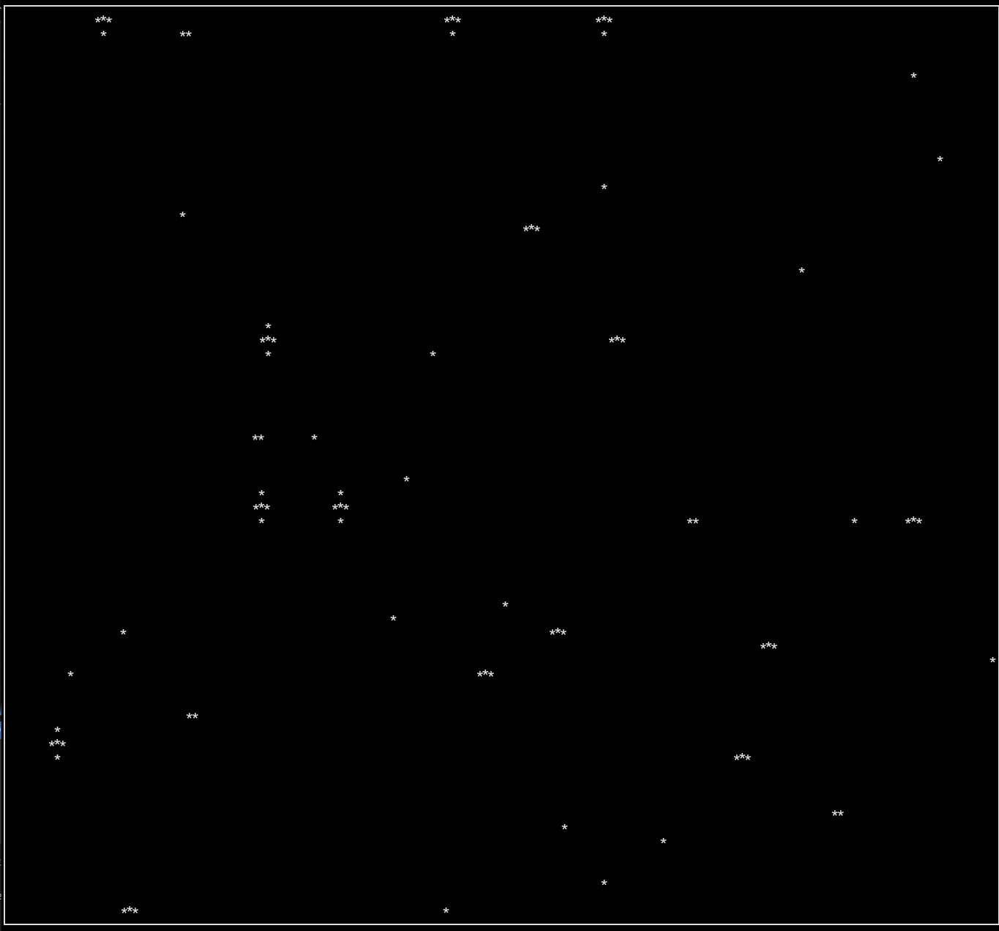

# Playground widgets for anathema


## Cooking
### Starfield
I thought I would have a go at another classic effect, the starfield. This is a simple example of how to use the `anathema` library to create a starfield effect.

Usage:
```
@starfield [width: 150, height: 70, stars: 40]
```

Attributes:
- `width`: The width of the starfield (default: 50)
- `height`: The height of the starfield (default: 50)
- `stars`: The number of stars in the starfield (default: 20)



### Graphs

I am experimenting with a way to visualise graphs in Anathema.